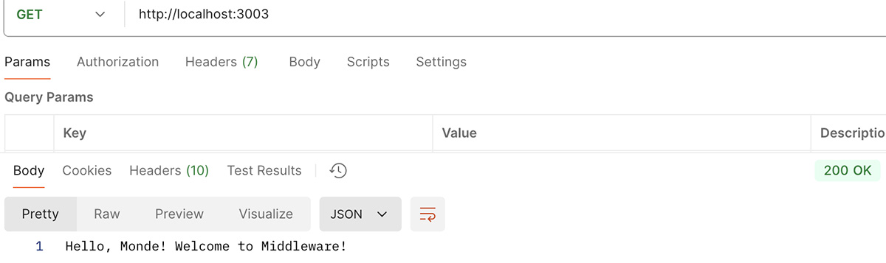
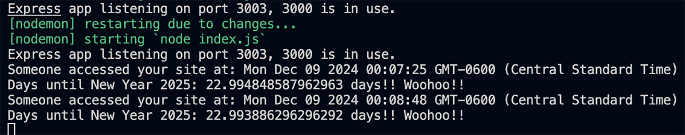
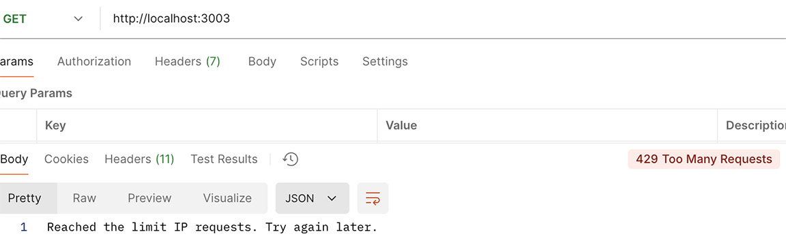

## **Express-Middleware**

## **Objective**
- Understand middleware in Express.
- Create and use custom middleware.
- Explore and use third-party middleware.

## **Instructions**
- Project Initialization

- [x] Create a new directory named express-middleware.
- [x] Navigate into the directory.
- [x] Initialize a new Node.js project = npm init -y
- [x] Install Express = 
- "npm install express, npm install --save-dev nodemon & npm install express-rate-imit"
- [x] Create the Server

- [x]  Create a file named index.js.
- [x]  Set up a basic Express server that listens on port 3000 or (3003).
- [x]  Create a route that responds with "Hello, Monde!" at the root URL.

- [x]  Create Custom Middleware

- [x] Add a custom middleware function that logs the details of each incoming request.
- [x] Ensure the middleware is used before defining the routes.
- [x] Test Custom Middleware

- [x] Make a request to the root URL and verify that the request details are logged in the console.

- [x] Install express-rate-limit.
- [x] Modify the server to use express-rate-limit to limit requests to 5 per minute.

- [x] Test Third-Party Middleware

